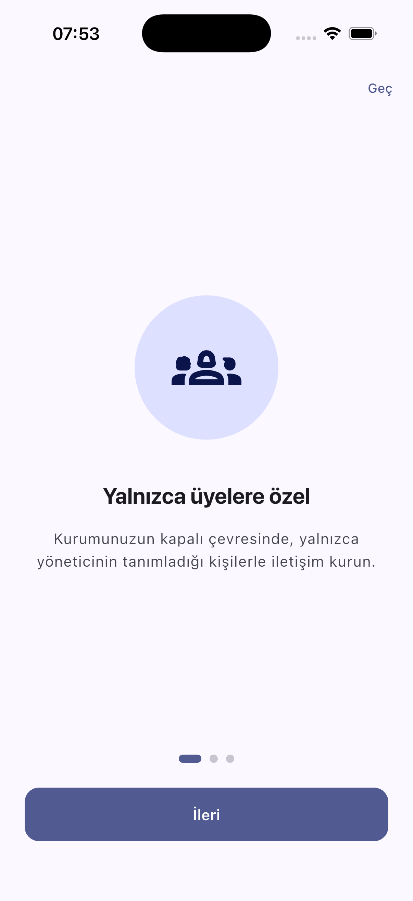
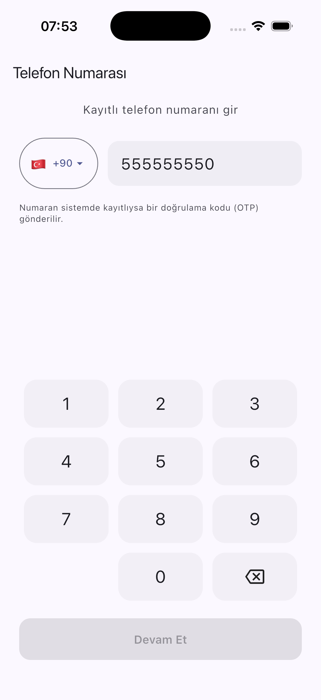
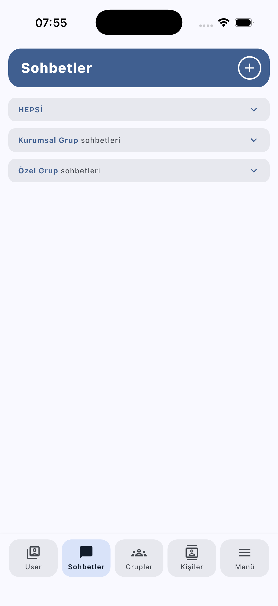
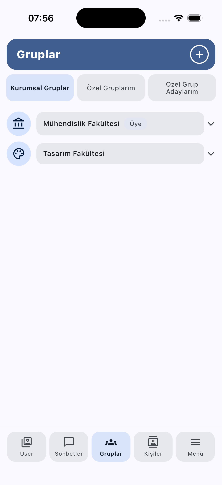
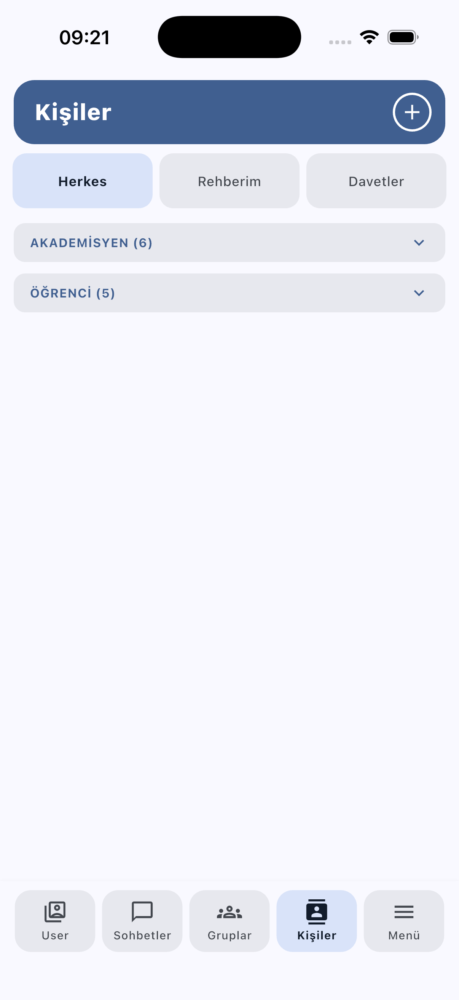
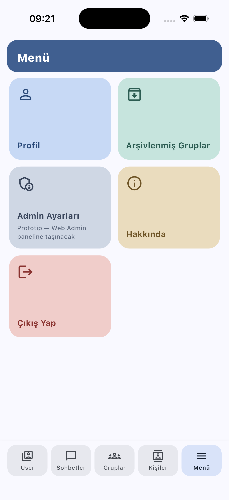
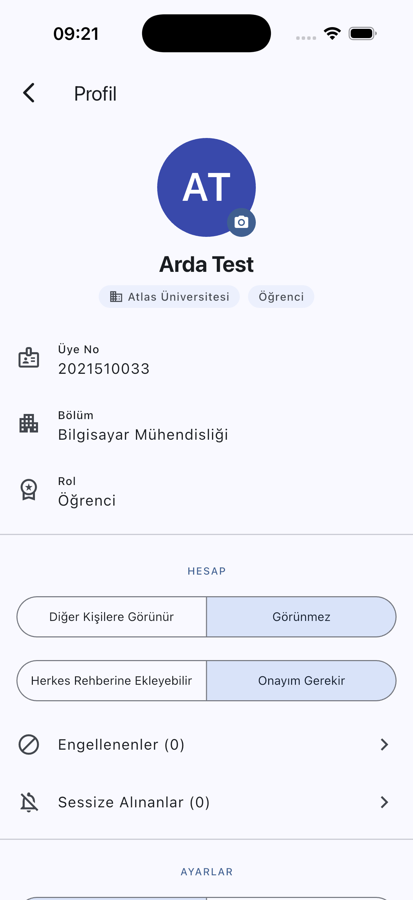
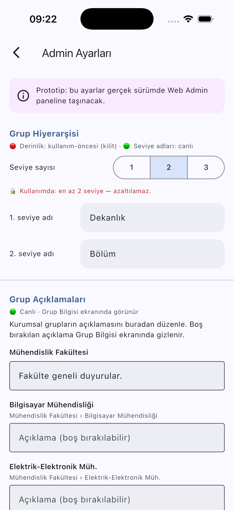
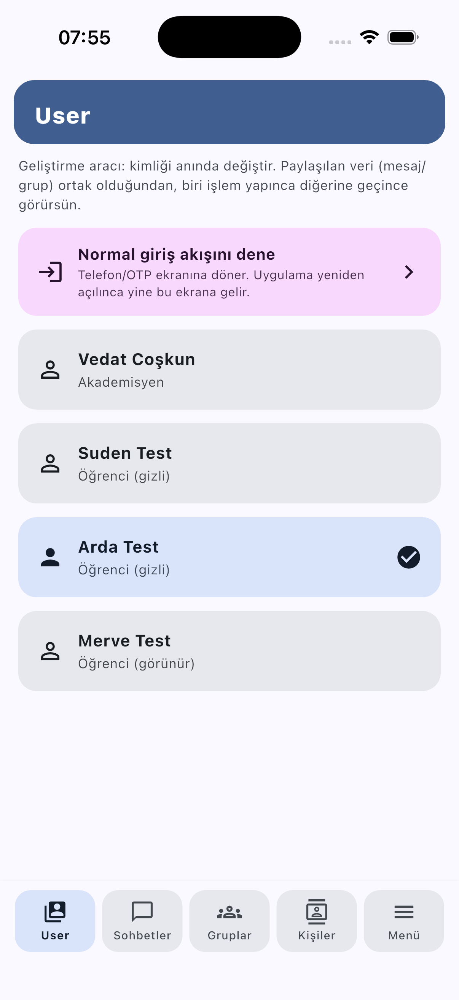

# GroupConnect — Kullanım Kılavuzu

> Bu kılavuz, GroupConnect uygulamasının **mevcut prototip sürümünü** ekran
> görüntüleriyle tanıtır. Görüntüler iOS simülatöründen, örnek "Atlas
> Üniversitesi" kurumu ve **Arda Test** (öğrenci) kimliğiyle alınmıştır.
>
> Sürüm: prototip (commit `5140c04` üzeri) · Son güncelleme: 2026-08-06

---

## GroupConnect nedir?

GroupConnect, bir organizasyonun (üniversite / site / dernek …) üyelerinin
**telefon numarası paylaşmadan**, **kapalı bir çevrede** ve gizlilikle iletişim
kurmasını sağlayan bir mesajlaşma ve rehber uygulamasıdır. Kişiler birbirini
kurum-içi bir **dizin** üzerinden bulur (telefon görünmez); mesaj içeriğini sunucu
veya yönetici göremez. Kurumsal hiyerarşiye uygun **kurumsal gruplar** ile kişiye
özel **özel gruplar** bir aradadır.

---

## 1. Karşılama (ilk açılış)

Uygulama ilk kez açıldığında kısa bir tanıtım turu gösterir. "Geç" ile atlanabilir,
"İleri" ile ilerlenir.

Ana mesaj: **"Yalnızca üyelere özel"** — kurumun kapalı çevresinde, yalnızca
yöneticinin tanımladığı kişilerle iletişim.

---

## 2. Giriş (telefon + doğrulama)

Giriş **telefon numarası** ile yapılır. Numara kurum sisteminde kayıtlıysa bir
**doğrulama kodu (OTP)** gönderilir; kod girilince oturum açılır. Parola yoktur.

- Ülke kodu soldaki kutudan seçilir (varsayılan +90).
- Numara girilip **Devam Et**'e basılır.
- Sonraki adımda gelen 6 haneli kod girilir. (Kullanıcı birden çok kuruma üyeyse
  ardından **kurum seçimi** gelir; "Tercihimi Hatırla" ile sonraki girişlerde bu
  adım atlanır.)

---

## 3. Sohbetler

Alt menüdeki ilk sekme. Tüm yazışmalar burada toplanır. Bölümler kutu-akordiyondur
(dokununca açılır):

- **HEPSİ** — gelen kutusu: en az bir mesajı olan tüm sohbetler (grup + birebir),
  son mesaj önizlemesi ve saatiyle, **en son yazışılan üstte**.
- **Kurumsal Grup sohbetleri** ve **Özel Grup sohbetleri** — üyesi olunan grupların
  dizini (içerik/saat göstermez, alfabetik). Gizlilik için mesaj içeriği yalnızca
  bilinçle açılan HEPSİ bölümünde görünür.
- Sağ üstteki **+** ile yeni sohbet başlatılır.

---

## 4. Gruplar

Üyesi olunan ve katılınabilecek grupları yönetir. Üç sekme vardır:

- **Kurumsal Gruplar** — yöneticinin kurduğu hiyerarşik gruplar (ör. *Mühendislik
  Fakültesi → Bölüm*). Üyesi olunan grup **"Üye"** rozetiyle işaretlidir; kutuyu
  açınca alt gruplar/üyeler görünür. Bu gruplara bireysel katılma/ayrılma yoktur.
- **Özel Gruplarım** — kullanıcının kendi kurduğu özel gruplar.
- **Özel Grup Adaylarım** — "Herkese Açık" yapılmış, davetsiz katılınabilecek özel
  gruplar.
- Sağ üstteki **+** ile yeni özel grup oluşturulur.

---

## 5. Kişiler

Kişi rehberi ve keşif ekranı. Üç sekme:

- **Herkes** — kurum dizini; rollere göre gruplanır (ör. *Akademisyen (6)*,
  *Öğrenci (5)*). Kutuyu açınca kişiler listelenir; satırdaki **+** ile rehbere
  eklenir veya (gerekiyorsa) davet gönderilir.
- **Rehberim** — eklenmiş kişiler. "Rehberim / + Pasif" geçişiyle *pasif* kişiler de
  görüntülenebilir (bkz. Kavramlar).
- **Davetler** — gelen/giden davetler; gelen daveti **Reddet / Tek yönlü kabul /
  Çift yönlü kabul** ile yanıtlarsın.

> **Görünürlük kuralı:** Kimin dizinde göründüğü, yöneticinin tanımladığı bir
> **rol matrisi** ile belirlenir; bu bir **varsayılandır, engel değildir**. Ayrıntı
> için "Kavramlar" bölümüne bakın.

---

## 6. Menü

Profil, arşiv, yönetim ve çıkış kısayolları:

- **Profil** — kendi bilgilerin ve hesap ayarların (aşağıda).
- **Arşivlenmiş Gruplar** — arşive alınan gruplar (silme yoktur, arşivlenir).
- **Admin Ayarları** — kurum yönetimi ayarları (prototipte buradadır; gerçek
  sürümde ayrı bir Web Admin paneline taşınacaktır).
- **Hakkında** ve **Çıkış Yap**.

---

## 7. Profil ve Hesap ayarları

Menü → Profil. Kimlik bilgileri (ad, üye no, bölüm, rol) ve **HESAP** ayarları:

- **Diğer Kişilere Görünür / Görünmez** — dizinde görünürlüğünü belirler.
- **Herkes Rehberine Ekleyebilir / Onayım Gerekir** — biri seni rehberine
  eklemek istediğinde onay isteyip istemediğin.
- **Engellenenler**, **Sessize Alınanlar** ve (aşağıda) görünüm/yazı boyutu ayarları.

> **Not:** Yöneticin senin rolünü *kilitlediyse* bu iki anahtar görünmez; onların
> yerine "kurum yönetimi tarafından sabitlenmiştir" notu çıkar.

---

## 8. Admin Ayarları (kurum yönetimi)

Kurumun genel kurallarını belirleyen ekran. (Prototip; gerçekte Web Admin panelinde
olacak.)

- **Grup Hiyerarşisi** — grup derinliği (1–3 seviye) ve seviye adları (ör. *Dekanlık
  → Bölüm*). Kullanımdaki seviyeler kilitlenir (azaltılamaz).
- **Grup Açıklamaları** — kurumsal grupların açıklamalarını düzenleme.
- (Aşağıda) **Görünürlük Varsayılanı** + rol-başına **kilit**, **Otomatik Görme ve
  Ekleme matrisi**, rol adları ve **Görünüm** (renk/yazı boyutu/font) ayarları.

---

## Kavramlar (kısa)

**Görünürlük — matris bir varsayılandır, engel değil.** Yönetici hangi rolün hangi
rolü *otomatik* göreceğini bir matrisle belirler. Matris dışındaki kişiler yine de,
kendilerini "Görünür" tuttukça dizinde görünür; yalnızca "Görünmez" seçen ve
matris-dışı olan kişi gizlenir. "Tamamen gizli" diye bir durum yoktur.

**Rehber ve davet — aktif/pasif.**
- Matrisin doğrudan gördüğü kişiyi (ya da "herkes ekleyebilir" diyeni) **anında**
  rehbere eklersin.
- Diğer durumlarda **onay daveti** gider. Davet edilen üç yanıt verebilir:
  **Reddet**, **Çift yönlü kabul** (iki taraf da birbirini ekler) veya **Tek yönlü
  kabul** (yalnız davet eden ekler; kabul eden için o kişi **Pasif** olur).
- **Aktif** = karşılıklı/doğrudan eklenen; **Pasif** = tek yönlü kabulle onayladığın
  ama kendi rehberine almadığın kişi.

**Gruplar.** *Kurumsal gruplar* yalnızca yönetici tarafından kurulur ve üyelendirilir
(davet/katılma yok, hiyerarşik). *Özel gruplar* kullanıcılarca kurulur; "Herkese
Açık" yapılırsa kurum üyeleri davetsiz katılabilir.

---

## Ek: Geliştirme aracı (yalnız prototip)

Prototipin debug sürümünde, tek simülatörde iki-kişilik akışları test etmek için en
solda bir **"User"** sekmesi bulunur: kimliği (Vedat / Suden / Arda / Merve) anında
değiştirir. Buradaki **"Normal giriş akışını dene"** butonu gerçek telefon/OTP giriş
akışına döner. **Bu sekme yalnızca geliştirme içindir ve gerçek sürümde bulunmaz.**

